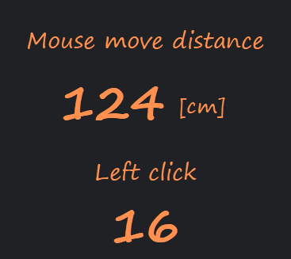

# Mouse Track Activity
Monitors and displays mouse activity in real time and with low CPU usage. Mouse movement distance is calculated based on the DPI in the configuration file.

Download from the [latest release](https://github.com/voltaney/MouseActivityMonitor/releases/latest).

## How it works
This software uses `Win32 API` to monitor the raw input of the mouse. The monitoring is event-driven, which runs only when there is a change in mouse input, thus reducing CPU usage.